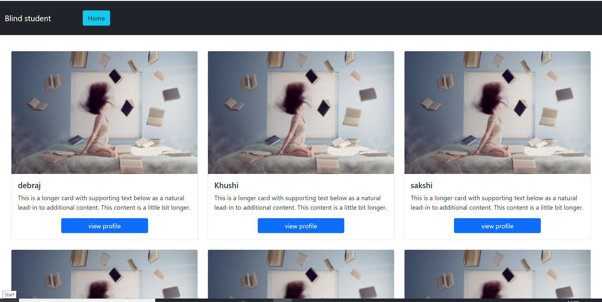

# Lightify 

This is a Lightify App which will help blind students to get writers and give an online exam.

#

## Introduction

This covid pandemic has hit us so hard that some people have lost their loved ones, some have lost their jobs and employment. In this time, we have adapted online education, work from home etc. but the special ones do not have enough resources to cope up with this online era. 

Like blind students and low-vision children do not have easy access to get writers and they are also facing problem to given an online exam.
While keeping this in mind, we have designed a Lightify application which will help blind students to get writers and to give an online exam. 

This application will provide a platform to connect helpers and needy, both of them will be able to sign up and connect with each other, and blind students will be able to specify their place and time, at which they need writers.

The second interesting feature of this application is an interactive audio-quiz platform where blind student can give a quiz exam without any need of writer. 

Currently this application supports above two features, we are planning to work on other functionalities in future. 

Hope this helps many students. 

#
## Screenshots

#
## Team Contribution
We are a group of four members including Agatya Panigrahy, Barenya Kumar Panda, Debraj bhal and Sakshi Singh Dangi. We have done all those things that we can do in this short span of time. Agatya and Barenya worked on front-end, Debraj worked on back-end and Sakshi worked on quiz platform. 

This was quite a challenge to bring up an idea and then implement it in 48 hours. We have done our best to help blind students and will continuously work on it. 

#
## Technology Used
- [Django-Python](https://github.com/django)
- [Web Speech Api](https://github.com/mdn/web-speech-api)
- [HTML](https://www.w3schools.com/html/)
- [CSS](https://www.w3schools.com/Css/)
- [JavaScript](https://www.w3schools.com/js/DEFAULT.asp)
- [Bootstrap](https://getbootstrap.com/)

#
## Bug Reporting
Feel Free to [open an issue](https://github.com/Barenyakumar/lightify/issues) on github if you find any bug.

#
## License
This software is open source, licensed under the [MIT License](/LICENSE).

